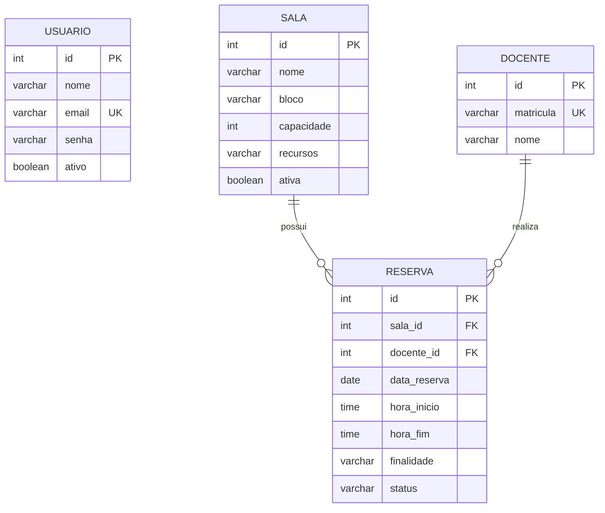

# Sistema de Agendamento de Salas de Aula

## Descrição do sistema

O Sistema de Agendamento de Salas de Aula é uma aplicação web desenvolvida para auxiliar professores e usuários administrativos no controle de salas disponíveis para aulas. O sistema permite cadastrar salas, cadastrar docentes e realizar reservas, evitando conflitos de horários para a mesma sala.

A aplicação possui autenticação por login, controle de sessão e telas protegidas para usuários autenticados.

## Funcionalidades

- Login de usuários e controle de sessão.
- Cadastro de novos usuários.
- CRUD de salas.
- CRUD de docentes.
- CRUD de reservas.
- Busca de salas disponíveis por dia, horário, capacidade e recurso.
- Validação de formulários e regras de negócio.
- Bloqueio de reserva em horários conflitantes.

## Requisitos atendidos

- Mínimo de 2 CRUDs: salas, docentes e reservas.
- Tela de processamento: busca de salas disponíveis e processamento de reservas.
- Controle de sessão do usuário.
- Arquitetura MVC.
- Uso de Spring MVC/Spring Boot.
- Projeto estruturado com Maven.
- Banco de dados com chaves estrangeiras.

## Tecnologias utilizadas

- Java 21
- Spring Boot / Spring MVC
- JSP e JSTL
- Maven
- PostgreSQL
- Docker Compose

## Arquitetura MVC

- `controller`: controla as rotas e o fluxo entre telas.
- `service`: concentra regras de negócio e validações.
- `dao`: realiza a comunicação com o banco de dados.
- `model`: representa as entidades do sistema.
- `src/main/webapp`: contém as páginas JSP, CSS e imagens.

## Diagrama ER



## Banco de dados

O banco possui quatro tabelas principais:

- `usuario`
- `docente`
- `sala`
- `reserva`

A tabela `reserva` possui chaves estrangeiras para `sala` e `docente`, garantindo o relacionamento entre as reservas, as salas e os professores.

Script de criação do banco:

`src/main/resources/db/migration/create_schema.sql`

Configuração usada pela aplicação:

- Host: `localhost`
- Porta: `5432`
- Banco: `sistema-agendamento-salas`
- Usuário: `postgres`
- Senha: `postgres`

Arquivo de conexão:

`src/main/java/org/agendamento/sistemaagendamentoaulas/dao/ConexaoDB.java`

## Como instalar e executar

### Pré-requisitos

- Java 21 configurado no IntelliJ IDEA.
- Docker e Docker Compose instalados.
- Maven Wrapper do projeto, já incluído nos arquivos `mvnw` e `mvnw.cmd`.

### Subir o banco com Docker

A partir da pasta `dev-infra`, execute:

```bash
docker compose up
```

O Docker Compose cria o banco PostgreSQL e executa automaticamente o script:

`src/main/resources/db/migration/create_schema.sql`

### Executar a aplicação

No IntelliJ IDEA, execute a classe principal:

`src/main/java/org/agendamento/sistemaagendamentoaulas/SistemaAgendamentoAulasApplication.java`

Também é possível executar pelo terminal:

```bash
mvnw.cmd spring-boot:run
```

No Linux ou macOS:

```bash
./mvnw spring-boot:run
```

Após iniciar a aplicação, acesse:

`http://localhost:9090`

## Como utilizar

1. Acesse a tela inicial do sistema.
2. Crie uma conta ou faça login com um usuário já cadastrado.
3. Cadastre docentes.
4. Cadastre salas com bloco, capacidade e recursos.
5. Acesse a área de reservas para criar, editar ou cancelar uma reserva.
6. Use a busca de salas para encontrar salas disponíveis por dia, horário, capacidade e recursos.

## Observações

O sistema valida campos obrigatórios nos formulários e também aplica validações no backend. Ao cadastrar ou editar uma reserva, o sistema impede que a mesma sala seja reservada em horários conflitantes.
